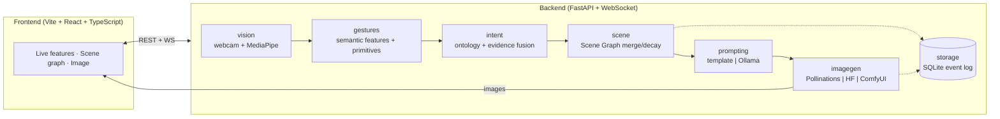

# IntuitivePromptEngine

[](https://github.com/goyal-harshit/intuitive-prompt-engine/actions/workflows/ci.yml)
[](https://github.com/goyal-harshit/intuitive-prompt-engine/actions/workflows/deploy.yml)
[](https://www.python.org/downloads/)
[](docker-compose.yml)
[](LICENSE)
[](https://github.com/astral-sh/ruff)
[](frontend)
[](https://codecov.io/gh/goyal-harshit/intuitive-prompt-engine)

**An intent-driven multimodal prompt generation system.** IntuitivePromptEngine watches your hands, posture, and expression through a standard webcam, infers your *creative intention* — not commands — and continuously compiles an evolving Scene Graph of your imagination into optimized prompts for generative image models. **You never type a prompt.**

> Rather than mapping gestures to commands, the engine extracts continuous semantic features (openness, expansion rate, circularity, tempo, smoothness, affect…), segments them into motion primitives, fuses them with interaction history into confidence-scored intent hypotheses, and merges those into a persistent Scene Graph. When the graph is complete and stable, a swappable prompt strategy compiles it into a diffusion-ready prompt and a swappable image backend renders it.

<!-- DEMO: drop a screen recording here once captured (webcam required):
      -->

---

## Architecture



Every stage sits behind an interface (`FrameSource`, `LandmarkExtractor`, `IntentModel`, `PromptGenerator`, `ImageGenerator`) — swap a model or backend without touching the rest. Full design: [docs/ARCHITECTURE.md](docs/ARCHITECTURE.md) · [docs/GESTURE_ONTOLOGY.md](docs/GESTURE_ONTOLOGY.md) · [docs/SCENE_GRAPH.md](docs/SCENE_GRAPH.md) · [docs/API.md](docs/API.md) · [docs/DATA_MODELS.md](docs/DATA_MODELS.md) · [docs/ROADMAP.md](docs/ROADMAP.md).

---

## Quick start

Two ways to run. The **native** path is webcam-enabled and best for actually using the interface; the **Docker** path is the reproducible, production-style stack (webcam capture is a host-only concern — see the note below).

### A. Native (CPU-only, no API keys) — recommended for using the webcam

Requires Python 3.10–3.12 and a webcam.

**Windows — one click:** double-click **`start.bat`**. On first run it creates the virtual environment, installs dependencies, then launches the server and opens your browser. Subsequent runs skip straight to launch; if port 8000 is busy it moves to the next free port.

**Manual (any OS):**

```bash
git clone https://github.com/goyal-harshit/intuitive-prompt-engine && cd intuitive-prompt-engine
python -m venv .venv
.venv\Scripts\activate          # Windows   (Linux/macOS: source .venv/bin/activate)
pip install -r requirements.txt
python run.py
```

Open the printed URL (default `http://127.0.0.1:8000`), click **Start session**, and gesture. Images are generated through the free Pollinations FLUX endpoint by default — no GPU, no key.

### B. Docker (full stack: API + nginx frontend)

Requires Docker Desktop / Docker Engine with Compose.

**Windows — one click:** double-click **`docker-start.bat`**. It detects Docker, builds the images from scratch if they are not present yet, then starts the stack.

**Any OS:**

```bash
docker compose up --build
```

- Frontend: <http://localhost:8080>
- API: <http://localhost:8010/api/health> (interactive docs at `/docs`)

If those ports collide with another project's containers on your machine, copy [`.env.example`](.env.example) to `.env` and change `BACKEND_PORT` / `FRONTEND_PORT` / `OLLAMA_PORT`.

Enable a local Ollama LLM for prompt optimization:

```bash
docker compose --profile ollama up --build
```

> **Webcam & Docker.** The gesture pipeline reads a physical camera, which containers cannot access portably (especially on Windows/macOS Docker Desktop). The containerized backend therefore serves the REST/WebSocket API, health, config, and stored generations; the live capture loop runs when you use the **native** path. On Linux you can pass a device through with `--device /dev/video0`.

### Optional upgrades

Each is a `config.yaml` change (or an env var), nothing else:

- **Local LLM prompt optimization** — install [Ollama](https://ollama.com), `ollama pull qwen2.5:3b`. Auto-detected (`PROMPTING_STRATEGY=auto`).
- **Hugging Face SDXL** — set `HF_TOKEN`, switch `IMAGEGEN_BACKEND=huggingface`.
- **Local ComfyUI (SDXL/FLUX)** — Phase 4 adapter, see [docs/ROADMAP.md](docs/ROADMAP.md).

---

## Configuration

Runtime settings live in [`config.yaml`](config.yaml). For deployment, the settings below can be overridden with environment variables (env wins over YAML). Copy [`.env.example`](.env.example) to `.env` for Docker.

| Env var | Overrides | Default | Notes |
|---|---|---|---|
| `IMAGEGEN_BACKEND` | `imagegen.backend` | `pollinations` | `pollinations` \| `huggingface` \| `comfyui`. Preferred backend only — if it errors, the app auto-falls-back to any other usable backend (e.g. `huggingface` if `HF_TOKEN` is set) before failing. |
| `PROMPTING_STRATEGY` | `prompting.strategy` | `auto` | `auto` \| `template` \| `ollama` |
| `OLLAMA_URL` | `prompting.ollama_url` | `http://127.0.0.1:11434` | Ollama endpoint for LLM prompting |
| `HF_TOKEN` | — | _unset_ | Hugging Face Inference token (huggingface backend) |
| `SERVER_HOST` | `server.host` | `127.0.0.1` | `0.0.0.0` in the container |
| `SERVER_PORT` | `server.port` | `8000` | `run.py` also honors `PORT` |
| `DATA_DIR` | `data_dir` | `./data` | SQLite DB + generated images; mounted as a volume in Docker |
| `CORS_ORIGINS` | `server.cors_origins` | Vite dev origins | Comma-separated allowed browser origins; add your GitHub Pages origin when deploying |
| `API_KEY` | — | _unset_ | Shared secret for `/api/*` (`X-API-Key` header) and `/ws/{id}` (`?api_key=`); unset = open API (local/dev default) |
| `SESSION_TTL_S` | `server.session_ttl_s` | `1800` | Seconds of inactivity before an abandoned session's camera/thread is auto-stopped |

Native (non-Docker) runs also load a `.env` file in the project root automatically if present (via `python-dotenv`), so `.env.example` works the same way outside Docker.

---

## API

FastAPI backend, default `http://127.0.0.1:8000`; the SPA is served at `/`. Interactive OpenAPI docs at `/docs`, schema at `/openapi.json`.

| Method | Path | Purpose |
|---|---|---|
| GET | `/api/health` | liveness + active backends |
| POST | `/api/session` | start a session → `{session_id}` |
| DELETE | `/api/session/{id}` | stop session, persist final snapshot |
| GET | `/api/session/{id}/scene` | current Scene Graph JSON |
| GET | `/api/session/{id}/generations` | list generated images (metadata) |
| POST | `/api/session/{id}/generate` | force a generation |
| GET | `/api/session/{id}/frame` \| `/video` | annotated camera frame / MJPEG stream |
| GET | `/api/images/{image_id}` | image bytes |
| GET | `/api/config` | active configuration |
| WS | `/ws/{session_id}` | live features, primitives, intents, scene updates, generations |

Full contract: [docs/API.md](docs/API.md).

---

## Project structure

```
backend/
  vision/     webcam capture + MediaPipe landmark extraction
  gestures/   semantic feature math + motion-primitive segmentation
  intent/     declarative ontology + evidence-fusion engine
  scene/      Scene Graph: merge semantics, decay, completeness, diff
  prompting/  strategies: template | Ollama (auto-detected)
  imagegen/   adapters: Pollinations | HF Inference | ComfyUI
  storage/    SQLite event log (full session replay)
  pipeline/   orchestrator wiring
  app/        FastAPI + WebSocket
  core/       typed config (+ env overrides) and the event bus
frontend/     Vite + React + TypeScript + Tailwind SPA (live features, scene graph, image)
  src/        components, hooks (useWebSocket, useSession), generated API types
  legacy/     archived pre-migration zero-build SPA (kept for reference)
docs/         architecture & research design docs
tests/        unit + integration tests
Dockerfile · docker/ · docker-compose.yml     containerized stack (docker/frontend.Dockerfile builds the nginx-served SPA)
.github/workflows/  ci.yml (backend + frontend lint/type/test/build) · deploy.yml (Pages)
```

---

## Development & testing

**Backend:**

```bash
pip install -r requirements-dev.txt
ruff check .      # lint
mypy              # type-check
pytest            # unit + integration tests
```

**Frontend** (in `frontend/`):

```bash
npm install
npm run dev              # Vite dev server on :5173, proxies /api and /ws to :8000
npm run lint             # ESLint
npm run format:check     # Prettier
npm run test             # Vitest + Testing Library
npm run build            # production build → dist/
npm run generate-types   # regenerate src/types/api.d.ts from the backend's OpenAPI schema
```

CI ([`.github/workflows/ci.yml`](.github/workflows/ci.yml)) runs lint, type-check and the test suite on Python 3.10–3.12, runs the frontend's lint/format/test/build in a parallel job, and builds + smoke-tests the Docker stack on every push and PR. See [CONTRIBUTING.md](CONTRIBUTING.md).

---

## Deployment

- **Frontend → GitHub Pages.** [`deploy.yml`](.github/workflows/deploy.yml) publishes the built `frontend/dist` on push to `main` after CI passes. On Pages, click ⚙️ **Settings** in the topbar to point the static UI at your local backend URL (default `http://localhost:8000`).
- **Backend → any container host.** Build the image (`docker build -t ipe-backend .`) or use `docker compose` on a VM/host with the `engine-data` volume for persistence. Set `SERVER_HOST=0.0.0.0` (already the container default) and mount `/data`.
- **Hardening a public backend:** set `API_KEY`, `CORS_ORIGINS`, and `RATE_LIMIT_PER_MINUTE`. Full walkthrough of every topology (native, Docker, Pages + remote): [docs/DEPLOYMENT.md](docs/DEPLOYMENT.md). Vulnerability reports: [SECURITY.md](SECURITY.md).

---

## Tech

Python · OpenCV · MediaPipe · FastAPI · Pydantic · SQLAlchemy/SQLite · httpx · Ollama (Qwen/Mistral) · FLUX/SDXL · Docker · nginx. All free and open source.

## License

[MIT](LICENSE) © 2026 Harshit Goyal
